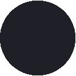

# Kanagawa-Kvantum  
A kvantum theme based on [Kanagawa-GTK-theme](https://github.com/Fausto-Korpsvart/Kanagawa-GKT-Theme).  
一个基于[Kanagawa-GTK-theme](https://github.com/Fausto-Korpsvart/Kanagawa-GKT-Theme)的Kvantum主题。  

## Declaration/声明  
Early development.  
早期开发。
## Palette/调色板  
<table>
  <tr>
    		<th></th>
	  	<th>Hex</th>
		<th>RGB</th>
		<th>HSL</th>
  </tr>
  <tr>
	  	<td></td>
		<td><code>#1f1f28</code></td>
		<td><code>rgb(31, 31, 40)</code></td>
		<td><code>hsl(240, 13%, 14%)</code></td>
  </tr>
  <tr>
	  	<td></td>
		<td><code>#dcd7ba</code></td>
		<td><code>rgb(220, 215, 186)</code></td>
		<td><code>hsl(51, 33%, 80%)</code></td>
  </tr>
  <tr>
	  	<td></td>
		<td><code>#dca561</code></td>
		<td><code>rgb(220, 165, 97)</code></td>
		<td><code>hsl(33, 64%, 62%)</code></td>
  </tr>
  <tr>
	  	<td></td>
		<td><code>#76946a</code></td>
		<td><code>rgb(118, 148, 106)</code></td>
		<td><code>hsl(103, 17%, 50%)</code></td>
  </tr>
  <tr>
	  	<td></td>
		<td><code>#c34043</code></td>
		<td><code>rgb(195, 64, 67)</code></td>
		<td><code>hsl(359, 52%, 51%)</code></td>
  </tr>
  <tr>
	  	<td></td>
		<td><code>#39363d</code></td>
		<td><code>rgb(57, 54, 61)</code></td>
		<td><code>hsl(266, 6%, 23%)</code></td>
  </tr>
  <tr>
	  	<td></td>
		<td><code>#2eb8e6</code></td>
		<td><code>rgb(46, 184, 230)</code></td>
		<td><code>hsl(195, 79%, 54%)</code></td>
  </tr>
  <tr>
	  	<td></td>
		<td><code>#ff6666</code></td>
		<td><code>rgb(255, 102, 102)</code></td>
		<td><code>hsl(0, 100%, 70%)</code></td>
  </tr>
</table>
